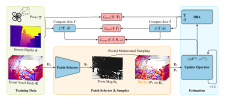
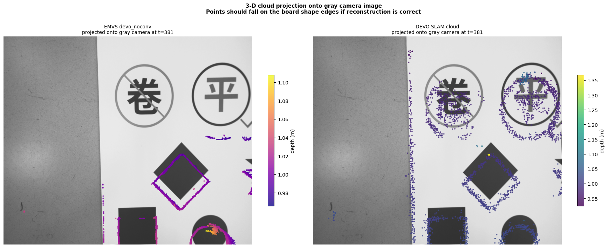
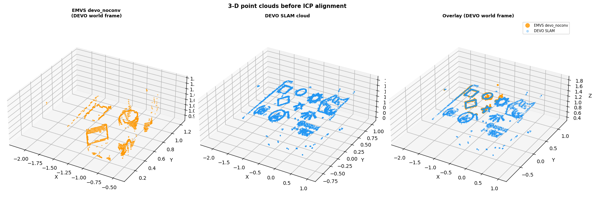

<h1 align="center">DEVO Point Cloud</h1>
<p align="center">
<strong>Extending Deep Event Visual Odometry with Sparse Point Cloud Export</strong>
</p>
<p align="center">
<a href="http://arxiv.org/abs/2605.22890"><strong>Our Paper arXiv</strong></a> |
<a href="https://github.com/FiveTe/DEVO-point-cloud"><strong>Code</strong></a> |
<a href="https://github.com/Alireza-Safdari-Khosroshahi/DEVO-point-cloud-docker"><strong>Docker Setup</strong></a> |
<a href="#citation"><strong>Citation</strong></a>
</p>
<p align="center">
  <strong>Authors:</strong> Alireza Safdari, Sajad Ashraf
</p>

---

## About This Repository

This repository is an extension of the original **Deep Event Visual Odometry DEVO** framework by Simon Klenk, Marvin Motzet, Lukas Koestler, and Daniel Cremers.

The original DEVO system introduced a monocular event only visual odometry pipeline that estimates camera motion from event camera data using sparse patch tracking, learned patch selection, recurrent correspondence refinement, and differentiable bundle adjustment. DEVO was published at **3DV 2024** and demonstrated strong performance across several real world event based visual odometry benchmarks.  [oai_citation:0‡arXiv](https://arxiv.org/abs/2312.09800?utm_source=chatgpt.com)

Our work builds on DEVO and extends it with a **sparse point cloud export pipeline**. Instead of changing the core visual odometry formulation, this project exposes the internal sparse 3D structure already estimated by DEVO and converts it into an explicit point cloud representation for visualization, analysis, and downstream processing. This extension is described in our arXiv paper **Extending Deep Event Visual Odometry with Sparse Point Cloud Export**.  [oai_citation:1‡arXiv](https://arxiv.org/abs/2605.22890?utm_source=chatgpt.com)

---

## Main Contribution

The original DEVO pipeline focuses primarily on accurate camera pose estimation from monocular event data. Our contribution adds access to the sparse geometric reconstruction that is already maintained internally during odometry estimation.

This repository adds:

- sparse point cloud extraction from DEVO’s internal 3D representation
- exportable point cloud and depth outputs from evaluation helper functions
- a practical workflow for point cloud generation, conversion, and cleanup
- documentation for using the exported data in visualization or downstream processing
- a Docker based setup for easier reproducibility
The goal is to preserve the original DEVO odometry behavior while making its sparse scene geometry available outside the optimization pipeline.

---

## Relation to the Original DEVO Work

This project is **not a replacement for DEVO**. It is an extension of the original open source DEVO implementation.
The original DEVO work provides:
- monocular event only visual odometry
- learned patch selection for event data
- sparse patch based tracking
- recurrent optical flow refinement
- differentiable bundle adjustment
- training and evaluation scripts for event based VO benchmarks
Our extension adds:
- access to DEVO’s internal sparse 3D estimates
- point cloud export functionality
- additional utilities for using the exported geometry
- analysis of sparse point cloud quality against EMVS style reconstruction
For full details of the original method, please refer to the DEVO paper and repository:
- Original paper: [Deep Event Visual Odometry](https://arxiv.org/abs/2312.09800)
- Original repository: [tum-vision/DEVO](https://github.com/tum-vision/DEVO)
---

## Abstract
Event cameras are well suited for visual odometry under high-speed motion and challenging lighting conditions due to their low latency, high temporal resolution, and high dynamic range. Deep Event Visual Odometry (DEVO) demonstrated that monocular event-only odometry can achieve strong performance by combining sparse patch tracking, learned patch selection, recurrent correspondence refinement, and differentiable bundle adjustment. In this project, we extend DEVO with a sparse point-cloud export pipeline. Rather than modifying the core odometry formulation, our approach exposes the internal 3D structure already estimated by DEVO and converts it into an explicit point-cloud representation for visualization and further processing. In addition, we implement a practical workflow for data export, format conversion, and point-cloud cleanup. The resulting system preserves the original visual odometry pipeline while enabling sparse geometric scene output. Experiments on the BOARD SLOW sequence show that the exported sparse cloud is locally consistent with EMVS reconstructions, achieving high precision at a 5 cm threshold, while also highlighting the expected limitations in density, completeness, and sensitivity to accumulated odometry noise.


## Overview
<p align="center">
  
  
  
</p>

## Point Cloud Export
This fork adds an opt-in hook to retrieve DEVO's sparse reconstruction at the end of
a run. Pass `return_observables=True` to the helpers in `utils/eval_utils.py`
(`run_rgb`, `run_voxel_norm_seq`, `run_voxel`) to receive the current point cloud
and per-patch depth estimates alongside poses and timestamps.

```python
from utils.eval_utils import run_rgb

poses, tstamps, flowdata, point_cloud, depths = run_rgb(
    imagedir=data_root,
    cfg=config,
    network=weights,
    iterator=sequence_iter,
    return_observables=True,
)
```

`point_cloud` and `depths` are NumPy arrays ready for export to `.ply`, `.npy`, or
any downstream format. A deeper explanation of the data flow and API surface lives
in `docs/point_cloud_export.md`.

During training, DEVO takes event voxel grids $`\{\mathbf{E}_t\}_{t=1}^N`$, inverse depths $`\{\mathbf{d}_t\}_{t=1}^N`$, and camera poses $`\{\mathbf{T}_t\}_{t=1}^N`$ of a sequence of size $N$ as input.
DEVO estimates poses $`\{\hat{\mathbf{T}}_t\}_{t=1}^N`$ and depths $`\{\hat{\mathbf{d}}_t\}_{t=1}^N`$ of the sequence.
Our novel patch selection network predicts a score map $\mathbf{S}_t$ to highlight optimal 2D coordinates $\mathbf{P}_t$ for optical flow and pose estimation.
A recurrent update operator iteratively refines the sparse patch-based optical flow $\hat{\mathbf{f}}$ between event grids by predicting $\Delta\hat{\mathbf{f}}$ and updates poses and depths through a differentiable bundle adjustment (DBA) layer, weighted by $\omega$, for each revision.
Ground truth optical flow $\mathbf{f}$ for supervision is computed using poses and depth maps. At inference, DEVO samples from a multinomial distribution based on the pooled score map $\mathbf{S}_t$.


## Setup
### Docker (Preconfigured Environment)

A ready-to-use Docker setup for this project is available here:

Repository: https://github.com/Alireza-Safdari-Khosroshahi/DEVO-point-cloud-docker

---

The code was tested on Ubuntu 22.04 and CUDA Toolkit 11.x. We use Anaconda to manage our Python environment.

First, clone the repo
```bash
git clone https://github.com/FiveTe/DEVO-point-cloud.git --recursive
cd DEVO-point-cloud
```
Then, create and activate the Anaconda environment
```bash
conda env create -f environment.yml
conda activate devo
```

Next, install the DEVO package
```bash
# download and unzip Eigen source code
wget https://gitlab.com/libeigen/eigen/-/archive/3.4.0/eigen-3.4.0.zip
unzip eigen-3.4.0.zip -d thirdparty

# install DEVO
pip install .
```

### Only for Training
*The following steps are only needed if you intend to (re)train DEVO. Please note, the training data have the size of about 1.1TB (rbg: 300GB, evs: 370GB).*

*Otherwise, skip it and go to [here](#only-for-evalution).*

First, download all RGB images and depth maps of [TartanAir](https://theairlab.org/tartanair-dataset/) from the left camera (~500GB) to `<TARTANPATH>`
```bash
python thirdparty/tartanair_tools/download_training.py --output-dir <TARTANPATH> --rgb --depth --only-left
```

Next, generate event voxel grids using [vid2e](https://github.com/uzh-rpg/rpg_vid2e).
```bash
python scripts/convert_tartan.py --dirsfile <path to .txt file>
```
`dirsfile` expects a .txt file containing line-separated paths to dirs with .png images (to generate events for these images).


### Only for Evalution
We provide a pretrained model for our simulated event data.

```bash
# download model (~40MB)
./download_model.sh
```

#### Data Preprocessing
We evaluate DEVO on seven real-world event-based datasets ([FPV](https://fpv.ifi.uzh.ch/), [VECtor](https://star-datasets.github.io/vector/), [HKU](https://github.com/arclab-hku/Event_based_VO-VIO-SLAM?tab=readme-ov-file#data-sequence), [EDS](https://rpg.ifi.uzh.ch/eds.html), [RPG](https://rpg.ifi.uzh.ch/ECCV18_stereo_davis.html), [MVSEC](https://daniilidis-group.github.io/mvsec/), [TUM-VIE](https://cvg.cit.tum.de/data/datasets/visual-inertial-event-dataset)). We provide scripts for data preprocessing (undist, ...).

Check `scripts/pp_DATASETNAME.py` for the way to preprocess the original datasets. This will create the necessary files for you, e.g. `rectify_map.h5`, `calib_undist.json` and `t_offset_us.txt`.  


## Training
Make sure you have run the [following steps](#only-for-training). Your dataset directory structure should look as follows

```
├── <TARTANPATH>
    ├── abandonedfactory
    ├── abandonedfactory_night
    ├── ...
    ├── westerndesert
```

To train DEVO with the default configuration, run
```bash
python train.py -c="config/DEVO_base.conf" --name=<your name>
```

The log files will be written to `runs/<your name>`. Please, check [`train.py`](train.py) for more options.

## Evaluation
Make sure you have run the [following steps](#only-for-evalution) (downloading pretrained model, data and preprocessing data).

```bash
python evals/eval_evs/eval_DATASETNAME_evs.py --datapath=<DATASETPATH> --weights="DEVO.pth" --stride=1 --trials=1 --expname=<your name>
```

The qualitative and quantitative results will be written to `results/DATASETNAME/<your name>`. Check [`eval_rpg_evs.py`](evals/eval_evs/eval_rpg_evs.py) for more options.

## News
- [x] Code and model are released.
- [x] Code for simulation is released.


## Citation
If you find our work useful, please cite our paper:

```bib
@inproceedings{klenk2023devo,
  title     = {Deep Event Visual Odometry},
  author    = {Klenk, Simon and Motzet, Marvin and Koestler, Lukas and Cremers, Daniel},
  booktitle = {International Conference on 3D Vision, 3DV 2024, Davos, Switzerland,
               March 18-21, 2024},
  pages     = {739--749},
  publisher = {{IEEE}},
  year      = {2024},
}
```


## Acknowledgments
We thank the authors of the following repositories for publicly releasing their work:

- [DPVO](https://github.com/princeton-vl/DPVO)
- [TartanAir](https://github.com/castacks/tartanair_tools)
- [vid2e](https://github.com/uzh-rpg/rpg_vid2e)
- [E2Calib](https://github.com/uzh-rpg/e2calib)
- [rpg_trajectory_evaluation](https://github.com/uzh-rpg/rpg_trajectory_evaluation)
- [Event-based Vision for VO/VIO/SLAM in Robotics](https://github.com/arclab-hku/Event_based_VO-VIO-SLAM)

This work was supported by the ERC Advanced Grant [SIMULACRON](https://cordis.europa.eu/project/id/884679).
